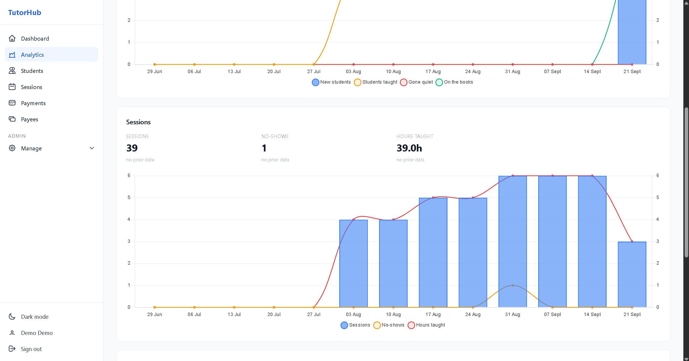
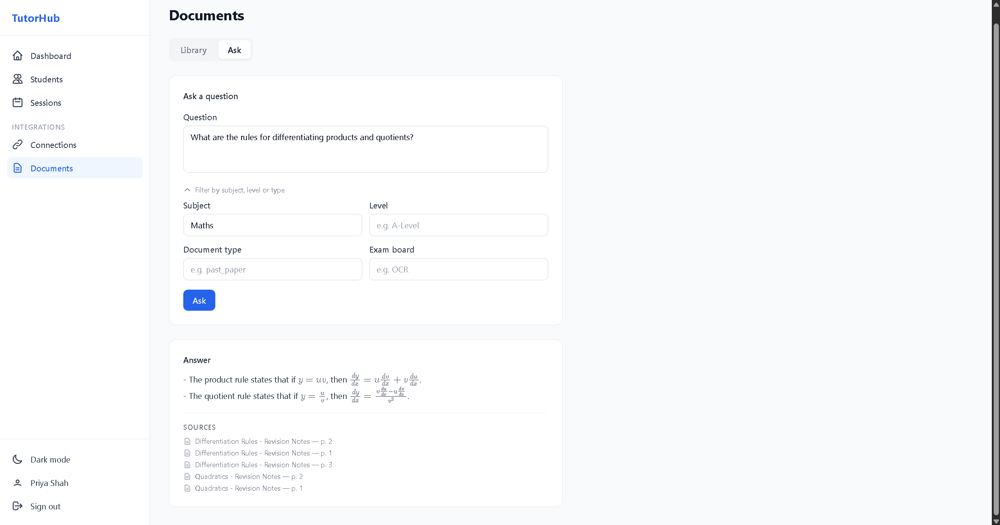
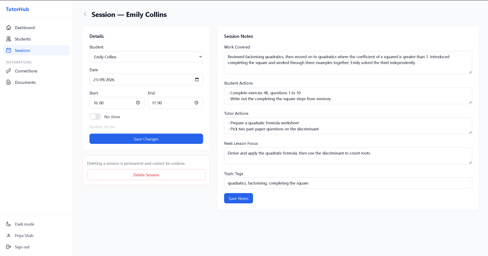
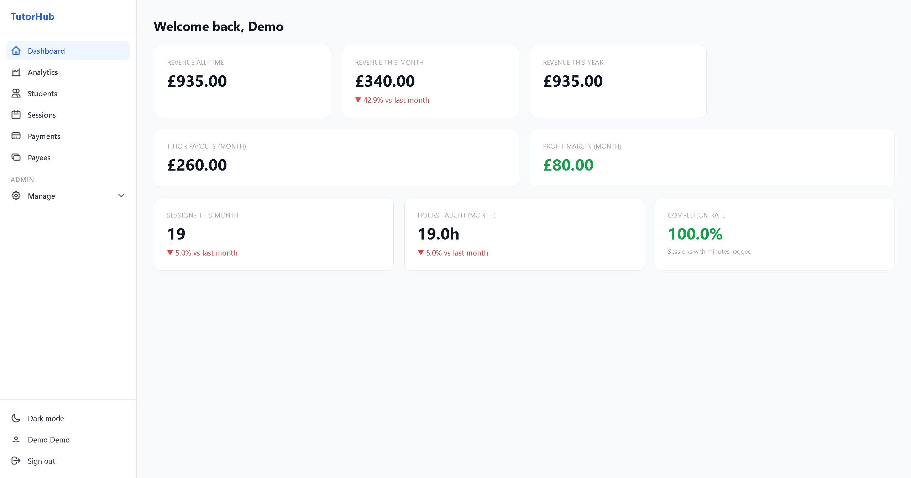
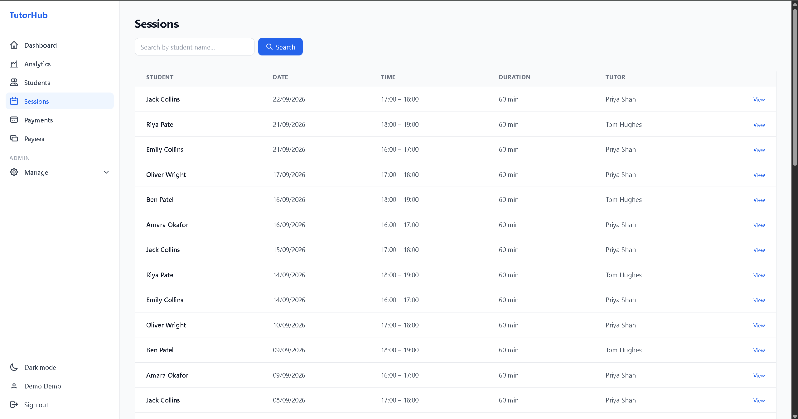
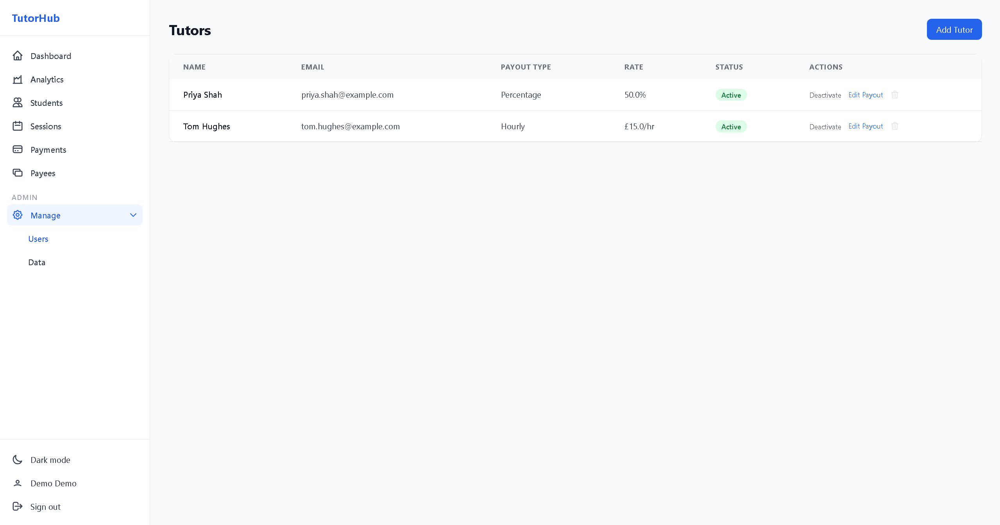
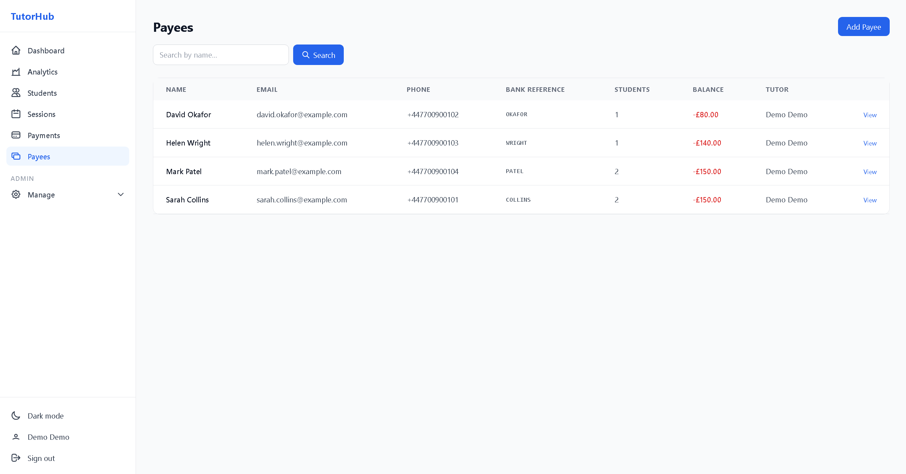
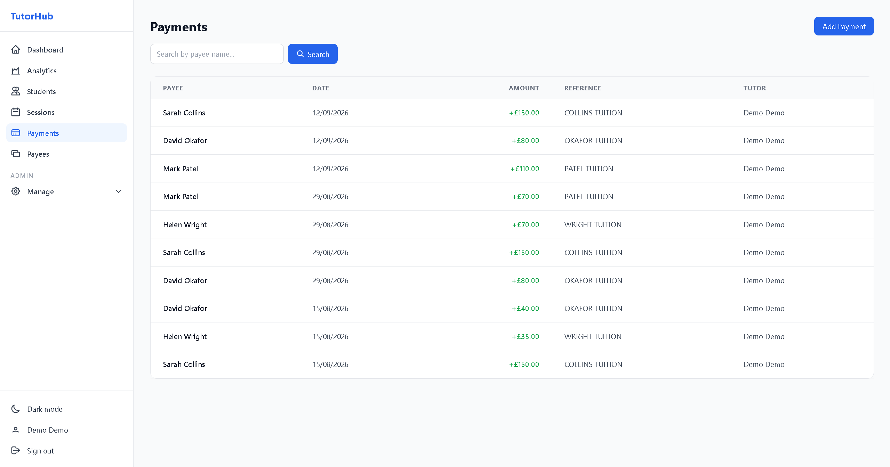
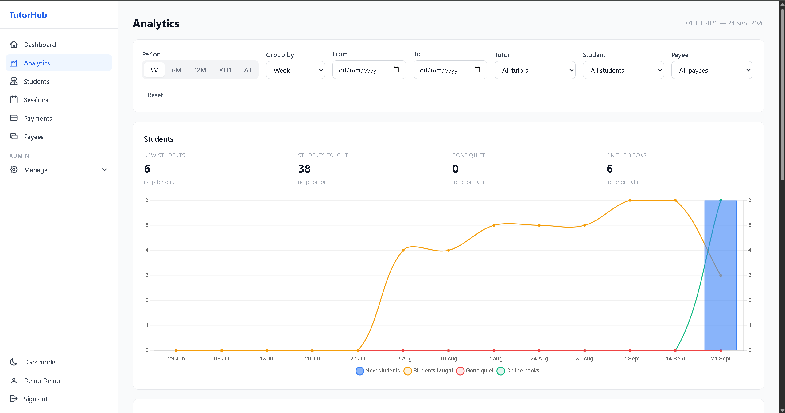
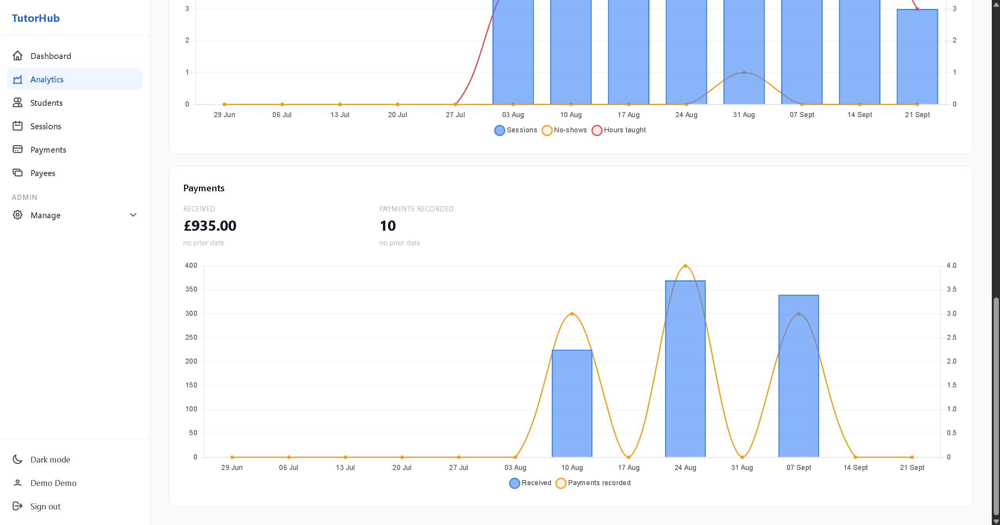

# TutorHub

[](https://github.com/arithman34/tutor_hub/actions/workflows/deploy.yml)
[](https://github.com/arithman34/tutor_hub/actions/workflows/deploy.yml)

A full-stack tutoring management platform. The backend is a FastAPI REST API with a PostgreSQL database. The frontend is a server-rendered web UI built with Jinja2 templates. It integrates with Google Calendar, uses OpenAI to parse Zoom session summaries into structured notes, and answers questions over uploaded teaching documents using retrieval-augmented generation (RAG) on pgvector.

**Live:** [tutorhub.arithman.dev/login](https://tutorhub.arithman.dev/login) | **API Docs:** [tutorhub.arithman.dev/docs](https://tutorhub.arithman.dev/docs)

## Screenshots

| Analytics | Document Q&A |
|---|---|
|  |  |
| **Session notes from a Zoom summary** | **Admin overview** |
|  |  |

<details>
<summary><strong>Admin pages</strong></summary>

| Sessions | Tutor accounts |
|---|---|
|  |  |
| **Payees and balances** | **Payments** |
|  |  |
| **Student trends** | **Payment trends** |
|  |  |

</details>

## Features

- Role-based access control (admin, tutor, admin\_tutor)
- Student profiles with Zoom, Google Docs, and OneDrive links
- Session logging with AI-powered Zoom summary parsing via OpenAI
- Document library: upload PDFs (past papers, textbooks, notes) and ask questions across them, filtered by subject, level, document type and exam board, with answers citing source pages (see [Document Q&A](#document-qa-rag))
- Payment and payee management
- Google Calendar integration (OAuth 2.0) for session scheduling
- Dashboard with analytics and KPIs
- Automated overdue payment alerts via email (Celery + Redis + Resend)
- Dark mode
- Alembic database migrations

## Document Q&A (RAG)

Tutors upload PDFs from the **Documents** page and ask questions across them. Retrieval runs inside the main app, against the same PostgreSQL database, using pgvector.

**Ingestion** ([`app/services/ingestion.py`](app/services/ingestion.py))

1. pdfplumber extracts the text page by page. Blank pages are skipped. A PDF with no extractable text, such as a scan without an OCR layer, is rejected.
2. Each page is split into 800-character chunks that overlap by 100 characters, so text cut at a boundary still appears in context in the next chunk. Chunks never span two pages, so each one keeps an exact page number.
3. All of a document's chunks are embedded in one batched call to OpenAI `text-embedding-3-small`, which returns 1536-dimensional vectors.
4. The document row (title, type, subject, level, optional exam board) and its chunks are written in a single transaction. Each chunk's embedding goes in a `vector(1536)` column.

**Querying** ([`app/services/query.py`](app/services/query.py))

1. The question is embedded with the same model.
2. One SQL query ranks chunks by cosine distance (pgvector's `<=>` operator) and returns the top 5. Any filters on document type, subject, level or exam board are `WHERE` clauses in that same query. The top 5 therefore always come from the filtered set; results are never trimmed after ranking.
3. The retrieved chunks go to `gpt-4o-mini`, each labelled with its document title and page number. The system prompt tells the model to answer only from that context and to say so when the answer isn't there.
4. The response lists the source document and page for every retrieved chunk, with duplicate pages removed. The UI renders LaTeX in answers with MathJax, so equations display properly.

Search is exact, with no approximate-nearest-neighbour index. For a single tutoring business's library, a sequential scan is fast and returns exact results. If the library grows, an HNSW index is the next step. Models, chunk size, overlap and `top_k` are set in [`app/core/config.py`](app/core/config.py) and can be overridden with environment variables (`EMBEDDING_MODEL`, `CHAT_MODEL`, `CHUNK_SIZE`, `CHUNK_OVERLAP`, `TOP_K`).

**Tests**

- [`tests/test_service_ingestion.py`](tests/test_service_ingestion.py) covers chunk boundaries and the 100-character overlap, rejection of PDFs with no text, and saving documents with and without the optional metadata.
- [`tests/test_service_query.py`](tests/test_service_query.py) covers the fallback when nothing matches, answers with sources, merging of sources that share a page, and metadata filters that exclude non-matching documents.

The OpenAI calls are mocked. The similarity queries run against a real pgvector database (the `pgvector/pgvector:pg17` service in CI), so the retrieval SQL is tested exactly as it runs in production.

## Technical decisions

**FastAPI over Django.** Most requests spend their time waiting on Postgres, OpenAI or Google. FastAPI with async SQLAlchemy and asyncpg handles that without tying up a worker per request. Pydantic schemas validate the REST API and generate the OpenAPI docs at `/docs`. The JSON API and the Jinja2 pages both call the same service layer. Django's main draws are its ORM and its built-in admin, and this project uses neither. The admin area is custom, and SQLAlchemy with Alembic gives direct control over schema changes such as the pgvector columns.

**Separate worker and beat processes.** Celery beat only schedules tasks, and exactly one instance must run, or the daily overdue alerts and the weekly export go out twice. Workers execute the tasks and can be restarted or scaled freely. Keeping both apart from the API means a slow email or export never holds up a web request. In the [`production`](terraform/environments/production) Terraform config they are three separate ECS services, each running a single task. The [`cost-optimized`](terraform/environments/cost-optimized) config, which is the one that runs live, keeps them as separate containers inside one Fargate task. The processes stay isolated, but only one task is billed.

**Terraform, split into layers.** All AWS infrastructure is defined in Terraform as three root modules. `foundation` holds the parts that are costly or impossible to recreate: the VPC, RDS with pgvector, ECR, IAM, and SSM secrets. `production` and `cost-optimized` are interchangeable compute layers that read foundation's outputs. Switching between the load-balanced three-service design and the single-task Cloudflare Tunnel design therefore never touches the database. GitHub Actions authenticates to AWS through OIDC, so no long-lived access keys are stored.

**RAG inside the app.** Document Q&A started as a separate service and was moved into the main app on pgvector. Chunks live in the same Postgres database as students and sessions. That leaves one database to back up and no second service to host or secure. Metadata filters are ordinary SQL against the same data. A document and its chunks commit in one transaction, so a failed upload never leaves a half-indexed document behind. The trade-off is that vector search shares the database with the transactional workload. That is fine at this scale, and because retrieval sits behind its own service module, it could be split out again later.

## Project Structure

```
tutor_hub/
├── app/
│   ├── api/v1/routers/     # REST API endpoints
│   ├── web/routers/        # Server-rendered web UI routes
│   ├── models/             # SQLAlchemy ORM models
│   ├── schemas/            # Pydantic request/response schemas
│   ├── services/           # Business logic layer
│   ├── tasks/              # Celery background tasks
│   ├── core/               # Config and database setup
│   ├── auth.py
│   ├── worker.py           # Celery app and beat schedule
│   └── main.py
├── alembic/                # Database migrations
├── templates/              # Jinja2 HTML templates
├── static/                 # CSS and JS assets
├── tests/
├── terraform/              # AWS infrastructure (foundation, production, cost-optimized)
├── docker/
├── docker-compose.yml
├── docker-compose.dev.yml
├── docker-compose.prod.yml
├── Dockerfile
└── .env.example
```

## Setup

### Prerequisites

Docker Desktop installed and running.

### Steps

Create a `.env` file from the example and fill in your values:

```bash
cp .env.example .env
```

The variables you must set are listed in the [Environment Variables](#environment-variables) section.

Build and start all services:

```bash
docker compose -f docker-compose.yml -f docker-compose.dev.yml up --build
```

The app will be available at `http://localhost:8000`.

Interactive API docs: `http://localhost:8000/docs`

To stop:

```bash
docker compose down
```

## Deployment

The app runs on AWS and is provisioned with Terraform. See [terraform/environments/README.md](terraform/environments/README.md) for the architecture and setup. The live setup is a single ECS Fargate Spot task that runs the API, the Celery worker, Celery beat, Valkey and a Cloudflare Tunnel sidecar. The database is RDS PostgreSQL with pgvector. Traffic reaches the app through the tunnel, so the task has no inbound ports open.

Every push to `main` runs the test suite, then the [deploy workflow](.github/workflows/deploy.yml):

1. Builds the image and pushes it to ECR, tagged with the commit SHA.
2. Registers a new task definition revision that points at that SHA tag.
3. Updates the ECS service and waits for the rollout to finish.

If the new task fails to start or fails its health check, the ECS deployment circuit breaker rolls the service back to the previous task definition revision, and the workflow fails. Each revision is pinned to a commit-specific image tag, so the rollback restores the previous image. A redeploy of `:latest` would just pull the broken image again.

To roll back by hand, point the service at an earlier revision:

```bash
aws ecs update-service --cluster tutorhub-lean --service app --task-definition tutorhub-lean-app:<revision>
```

## Running Tests

```bash
pytest
```

Coverage reports are written to `htmlcov/`. Open `htmlcov/index.html` in a browser to view line-by-line coverage.

## Environment Variables

| Variable | Description |
|---|---|
| `POSTGRES_USER` | PostgreSQL superuser name |
| `POSTGRES_PASSWORD` | PostgreSQL superuser password |
| `APP_DB_USER` | Application database user |
| `APP_DB_PASSWORD` | Application database password |
| `APP_DB_NAME` | Application database name |
| `SECRET_KEY` | Secret used to sign JWTs |
| `OPENAI_API_KEY` | API key from platform.openai.com |
| `GOOGLE_CLIENT_ID` | Google OAuth client ID |
| `GOOGLE_CLIENT_SECRET` | Google OAuth client secret |
| `GOOGLE_REDIRECT_URI` | OAuth redirect URI |
| `REDIS_URL` | Redis connection URL (default: `redis://redis:6379/0`) |
| `RESEND_API_KEY` | API key from resend.com for outbound email |
| `FROM_EMAIL` | Sender address for alert emails |

## API Endpoints

All REST endpoints are under the `/api/v1` prefix.

### Auth

| Method | Endpoint | Description | Auth required |
|---|---|---|---|
| POST | `/auth/login` | Log in and receive a JWT token | No |

### Users

| Method | Endpoint | Description | Auth required |
|---|---|---|---|
| GET | `/users/` | List all users | Admin |
| POST | `/users/` | Create a user | Admin |
| GET | `/users/{user_id}` | Get user details | Yes |
| PATCH | `/users/{user_id}/activate` | Activate a user | Admin |
| PATCH | `/users/{user_id}/deactivate` | Deactivate a user | Admin |
| GET | `/me/` | Get current user profile | Yes |
| PATCH | `/me/` | Update own profile | Yes |

### Students

| Method | Endpoint | Description | Auth required |
|---|---|---|---|
| GET | `/students/` | List students (supports `?q=` search) | Yes |
| POST | `/students/` | Create a student | Yes |
| GET | `/students/{student_id}` | Get student details | Yes |
| PATCH | `/students/{student_id}` | Update a student | Yes |
| POST | `/students/{student_id}/toggle-active` | Toggle active status | Yes |
| DELETE | `/students/{student_id}` | Delete a student | Admin |

### Sessions

| Method | Endpoint | Description | Auth required |
|---|---|---|---|
| GET | `/sessions/` | List sessions (supports `?q=` search) | Yes |
| POST | `/sessions/` | Log a session | Yes |
| GET | `/sessions/{session_id}` | Get session details | Yes |
| PATCH | `/sessions/{session_id}` | Update a session | Yes |
| DELETE | `/sessions/{session_id}` | Delete a session | Yes |

### Payments

| Method | Endpoint | Description | Auth required |
|---|---|---|---|
| GET | `/payments/` | List all payments | Admin |
| POST | `/payments/` | Create a payment | Admin |
| GET | `/payments/{payment_id}` | Get payment details | Admin |
| PATCH | `/payments/{payment_id}` | Update a payment | Admin |
| DELETE | `/payments/{payment_id}` | Delete a payment | Admin |

### Payees

| Method | Endpoint | Description | Auth required |
|---|---|---|---|
| GET | `/payees/` | List payees (supports `?q=` search) | Admin |
| POST | `/payees/` | Create a payee | Admin |
| GET | `/payees/{payee_id}` | Get payee details | Admin |
| GET | `/payees/{payee_id}/balance` | Get payee balance | Admin |
| PATCH | `/payees/{payee_id}` | Update a payee | Admin |
| DELETE | `/payees/{payee_id}` | Delete a payee | Admin |

## Tech Stack

| Layer | Technology |
|---|---|
| API | FastAPI, Uvicorn |
| Database | PostgreSQL, pgvector, SQLAlchemy (async), Alembic |
| Auth | JWT (python-jose), bcrypt (passlib) |
| AI | OpenAI API (Zoom summary parsing, embeddings, document Q&A) |
| PDF parsing | pdfplumber |
| Calendar | Google OAuth 2.0, Google Calendar API |
| Background tasks | Celery, Redis |
| Email | Resend |
| Templating | Jinja2, Tailwind CSS |
| Testing | pytest, pytest-asyncio, httpx, pytest-cov |
| Containerisation | Docker, Docker Compose |
| CI/CD | GitHub Actions |
| Hosting | AWS (ECS Fargate, RDS), Cloudflare Tunnel, Terraform |
